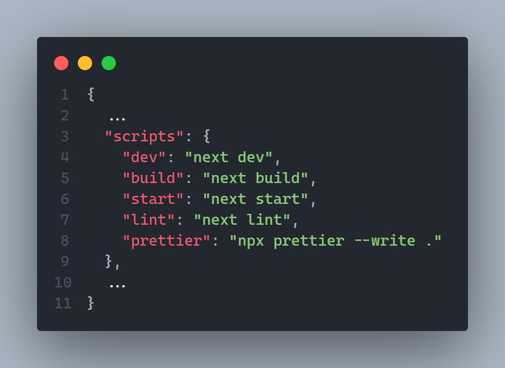

# Welcome to TranslateAI

TranslateAI is a NextJS project that serves as a Single Page Application (SPA). It is important to prioritize server-side rendering for all actions to ensure privacy.

### Usage

1. Clone this repository on your own workspace (or simply download the release)
2. Install all dependencies
```cmd
npm install
```
3. Set the **enviroment variables** on the `.env.local` file
```bash
BLOB_READ_WRITE_TOKEN="YOUR_VERCEL_BLOB_TOKEN"
OPENAI_API_KEY="YOUR_OPEN_AI_APIKEY"
USER_NAME="HARDCODED_USERNAME"
USER_PASSWORD="HARDCODE_PASSWORD"
```
> Remember this is just for the local development, in production you should set the variables on your own host.
4. Run the **lint** script for catching posible errors
```powershell
#npm
npm run lint
#yarn
yarn lint
#pnpm
pnpm run lint
```
5. ***(optional)*** If you wanna edit or remove code don't forget to check all the scripts, it may help you


